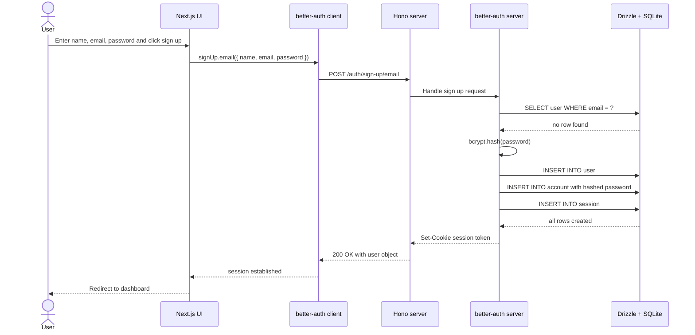
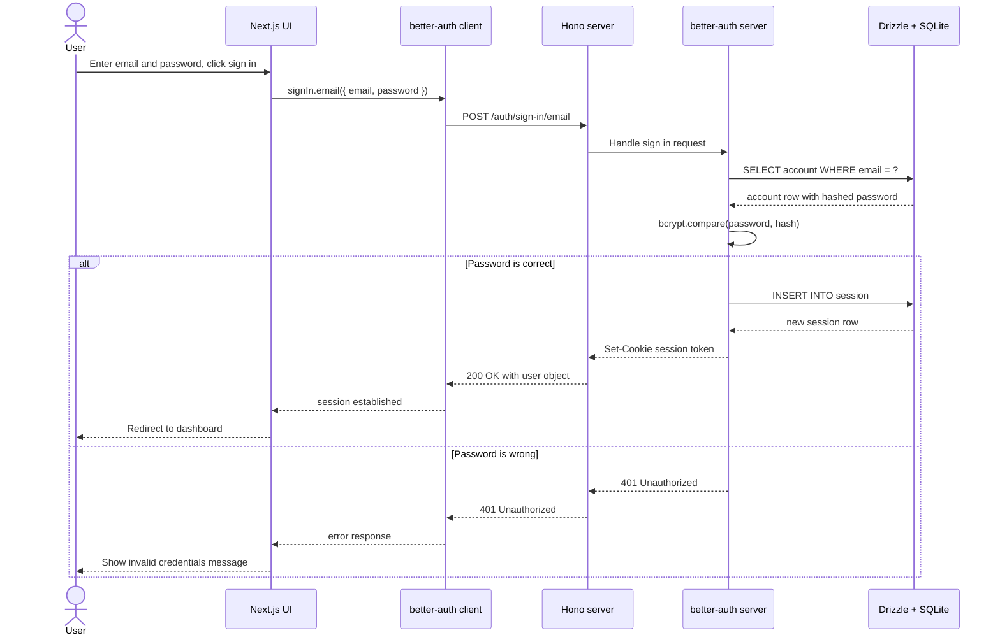
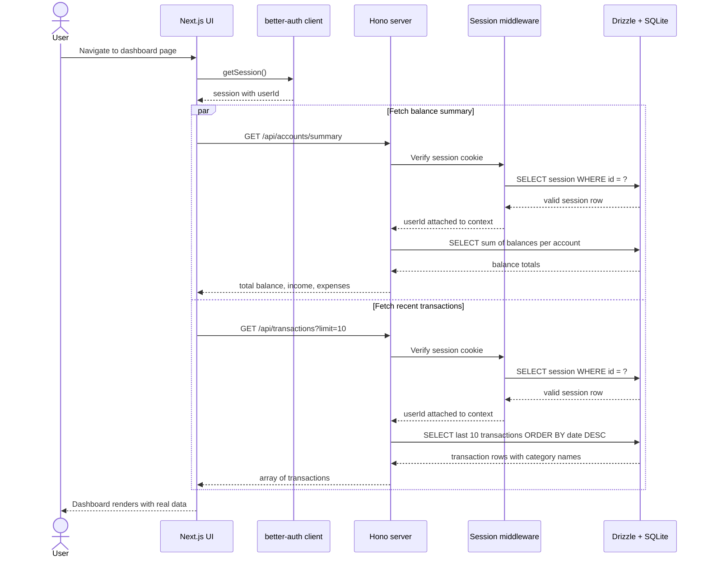
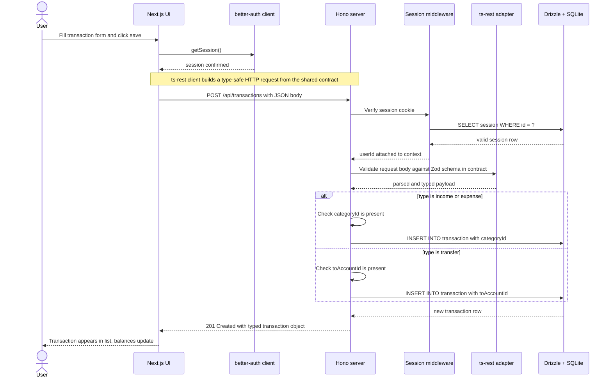
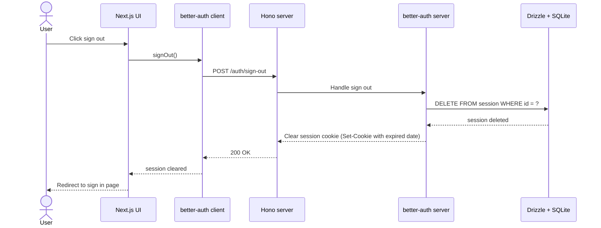

# Sequence Diagram Documentation

**Project:** FinanceOS
**Scope:** Key user flows and their request lifecycles

---

## Overview

This document describes the five most important flows in FinanceOS as sequence diagrams. Each flow is explained step by step so you understand not just what happens, but why each step exists. As a junior full-stack developer, these diagrams are your map for debugging — when something breaks, you will know exactly which layer to look at.

### Participants

| Participant | What it is | Where it lives |
|---|---|---|
| User | The person using the browser | — |
| Next.js UI | Frontend React components and pages | `apps/web` port 3000 |
| better-auth client | Auth SDK on the frontend | `apps/web/lib/auth-client.ts` |
| Hono server | Backend API and route handlers | `apps/server` port 4000 |
| Session middleware | Verifies the cookie on every request | `apps/server/src/middleware/session.ts` |
| better-auth server | Auth logic on the backend | `apps/server/src/auth.ts` |
| ts-rest adapter | Validates request/response against contract | `apps/server/src/routes/*.ts` |
| Drizzle + SQLite | Database queries and storage | `apps/server/src/db` |

---

## Flow 1 — Sign up

This creates the user account and immediately signs them in. You write none of this logic yourself — better-auth handles it. Your only job is to call `signUp.email()` on the client and configure the server once.



**Key things to understand:**

The password is never stored in plain text. better-auth hashes it with bcrypt before the INSERT and you never see the raw value anywhere in the flow.

Three rows are created in one flow — `user`, `account`, and `session`. This means the user is immediately signed in after registering without a separate sign in step.

After the user is created, this is a good place to seed their default categories. better-auth supports an `onAfterSignUp` hook where you can run a Drizzle insert for the default category rows.

---

## Flow 2 — Sign in



**Key things to understand:**

The session cookie is `HttpOnly`, meaning JavaScript on the page cannot read it. This protects against XSS attacks where malicious scripts try to steal the session token. The browser sends it automatically on every request to the Hono server.

The cookie is set on the Hono server's domain (`localhost:4000`). Your Next.js frontend at `localhost:3000` sends cross-origin requests with `credentials: 'include'` so the browser attaches the cookie. This is why CORS on the Hono server must explicitly allow `localhost:3000` and set `credentials: true`.

---

## Flow 3 — Load the dashboard

This is what happens when the user navigates to the overview page. Two API calls run in parallel to keep the load fast.



**Key things to understand:**

The two fetches run in parallel using `Promise.all`. They do not wait for each other. This keeps the dashboard load fast even if one query takes longer than the other.

The session cookie is verified on **every single request**, not just at sign in. Every protected route starts with the session middleware. If the cookie is missing or expired, the middleware returns `401` immediately and the route handler never runs.

If `getSession()` on the client returns null (session expired), your UI should redirect to `/sign-in` before making any API calls. A good pattern is a Next.js middleware file at the root that checks the session on every page navigation.

---

## Flow 4 — Add transaction

This is the most important flow to understand because it touches every layer of the stack. It also handles three distinct transaction types — income, expense, and transfer — each with slightly different validation rules.



**Key things to understand:**

**Session is verified on the server, always.** The client calls `getSession()` first only as a convenience check. The server always independently re-verifies the cookie. Never trust the client.

**Zod catches shape errors, business logic catches rule errors.** The Zod schema in the contract validates that `type` is one of the allowed enum values and that `amount` is a number. But it cannot express the rule "if type is transfer, toAccountId must be present" — that cross-field rule lives in your route handler as an explicit check before the Drizzle insert.

**Transfers have no category.** When `type = 'transfer'`, `categoryId` is null and `toAccountId` is set. This matches your hledger file where transfers like `Transfer to wallet` and `Withdrawal cash` move money between `assets:*` accounts with no `expenses:*` leg.

**The response returns the full new row** so the UI can update the transaction list immediately without a second fetch.

---

## Flow 5 — Sign out



**Key things to understand:**

Sign out does two things: deletes the session row from SQLite and tells the browser to clear the cookie by setting it with an expired date. Both must happen — deleting only the cookie means the row lingers in the database, and deleting only the row means the cookie persists in the browser until it expires naturally.

After sign out, any subsequent API request with the old cookie will hit the session middleware, fail to find the session row in the database, and return `401`. This is the correct behavior.

---

## Middleware order on the Hono server

Every request passes through middleware in this exact order before reaching a route handler:

```
1. Logger middleware       — logs method, path, and response time to console
2. CORS middleware         — allows requests from localhost:3000 with credentials
3. better-auth routes      — handles /auth/* paths, bypasses session check
4. Session middleware      — verifies cookie, attaches userId to context
5. ts-rest adapter         — validates request body against contract Zod schema
6. Route handler           — your business logic and Drizzle query
```

Steps 4, 5, and 6 only run for routes under `/api/*`. The `/auth/*` routes are handled entirely by better-auth at step 3 and return early.

```ts
// apps/server/src/index.ts — the order here is the actual execution order
const app = new Hono()

app.use('*', logger())
app.use('*', cors({ origin: 'http://localhost:3000', credentials: true }))

app.on(['GET', 'POST'], '/auth/**', (c) => auth.handler(c.req.raw))

app.use('/api/*', sessionMiddleware)
app.route('/api', transactionRouter)
app.route('/api', accountRouter)
app.route('/api', categoryRouter)
app.route('/api', budgetRouter)
app.route('/api', goalRouter)
```

---

## Error reference

Every flow can fail at multiple points. Here is what each failure looks like, where it happens, and how the UI should respond.

| Scenario | HTTP status | Where it is thrown | UI response |
|---|---|---|---|
| Wrong password on sign in | 401 | better-auth server | Show "Invalid email or password" |
| Email already taken on sign up | 422 | better-auth server | Show "Email already in use" |
| Request with no session cookie | 401 | Session middleware | Redirect to /sign-in |
| Request with expired session | 401 | Session middleware | Redirect to /sign-in |
| Invalid request body shape | 400 | ts-rest Zod adapter | Show field-level validation errors |
| Transfer missing toAccountId | 400 | Route handler business logic | Show "Destination account is required" |
| Income/expense missing categoryId | 400 | Route handler business logic | Show "Category is required" |
| Database constraint violation | 500 | Drizzle / route handler | Show "Something went wrong" |

A good pattern is a single global error handler on the ts-rest client that intercepts `401` responses and redirects to `/sign-in` automatically, so you do not have to handle it in every component.
