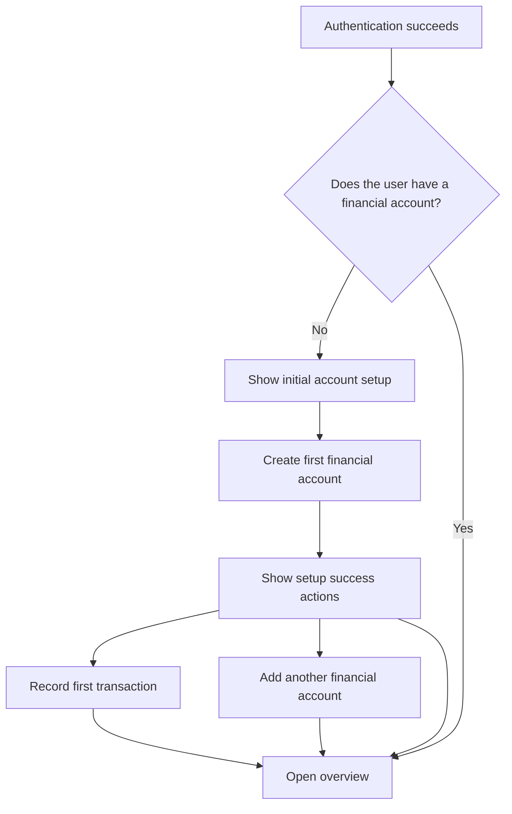

# FinanceOS Core Ledger User Flow

**Status:** Approved for ticketing  
**Last updated:** 23 August 2026

## Problem Statement

FinanceOS has authentication, dashboard, account, category, and transaction concepts, but they do not yet form one coherent product journey. After authentication, a new user can reach an empty or sample-data dashboard without first establishing where their money is held. This makes the ledger difficult to understand and prevents transaction entry from having a valid financial account.

The product needs one shared flow that defines what first-time and returning users experience, which setup is required, and how opening balances and subsequent ledger activity affect the balances shown to the user.

## Solution

After authentication, FinanceOS checks whether the user has at least one financial account.

- A user with no financial accounts enters initial account setup.
- A user with one or more financial accounts enters the overview.
- An accountless user who attempts to open another financial feature is returned to initial account setup.

Initial setup requires the user to create a financial account. Its opening balance is optional and defaults to zero. Once the account exists, the user can record a first income or expense, add another financial account, or open the overview. Starter categories are provided automatically so category configuration does not block the first transaction.

## Canonical Terms

### Financial account

A place where the user keeps money tracked by FinanceOS, such as a checking account, savings account, wallet, or cash.

Product-facing language must use **financial account** when the shorter word **account** could be confused with an authentication-provider account.

### Opening balance

The financial account's balance when the user begins tracking it in FinanceOS. The user-facing form label is **Starting balance**.

An opening balance establishes the initial position of a financial account. It is not income and must not contribute to income totals.

### Current balance

The derived balance of a financial account:

> opening balance + income - expenses + incoming transfers - outgoing transfers

Current balance is never maintained as a second independently editable value.

### Default account

A possible future preference that preselects a financial account during transaction entry. Creating the first financial account does not make it a special main or default account.

### Transaction kind

Income, expense, and transfer are derived from the transaction's account endpoints rather than selected or stored independently:

- Source account set and destination account absent: expense.
- Source account absent and destination account set: income.
- Different source and destination accounts both set: transfer.
- Both accounts absent, or the same account used on both sides: invalid.

Categories are neutral labels. They do not have an income or expense type.

## Primary User Flow

Authentication and ledger onboarding are separate responsibilities. Authentication establishes the user's identity and session. Ledger onboarding evaluates the user's financial-account state and selects the appropriate destination.

## First-Time User Journey

### 1. Authenticate

The user completes the supported authentication flow. Successful authentication establishes a session and enters the private application.

### 2. Evaluate ledger readiness

FinanceOS determines whether the authenticated user owns at least one financial account.

- Zero financial accounts: show initial account setup.
- One or more financial accounts: show the overview.
- Loading: do not briefly show the dashboard or setup screen while the state is unknown.
- Failure: show a retryable error rather than treating failure as an empty account list.

### 3. Create the first financial account

Initial account setup explains why a financial account is required:

> Set up where you keep your money. FinanceOS needs an account before it can record transactions.

The form contains:

- **Account name:** required and unique in combination with the owning user; for example, "Kasikorn Bank" or "Daily Cash."
- **Starting balance:** optional numeric amount; defaults to ฿0.
- **Currency:** THB, displayed as fixed information rather than an editable choice.

The primary action is **Create account and continue**.

Creating the first financial account must persist it for the authenticated user. Before any ledger entries exist, its current balance equals its opening balance.

### 4. Make the ledger immediately usable

FinanceOS provides an idempotent starter category set so the user does not have to configure categories during onboarding:

- Income
- Food
- Transport
- Shopping
- Bills
- Housing
- Health
- Other

Repeated setup or recovery must not create duplicate starter categories.

### 5. Continue from setup

After the financial account is created, the user sees a clear success state with three choices:

1. **Add first transaction** — primary action.
2. **Add another account** — secondary action.
3. **Go to overview** — tertiary action.

## Transaction Journey

### Income and expense

The transaction form collects:

1. Positive amount.
2. The source account for an expense, or the destination account for income.
3. Category.
4. Transaction note.
5. Transaction date.

The entry experience may ask whether the user is recording income, an expense, or a transfer to reveal the appropriate account fields. That choice only controls the form; FinanceOS derives the persisted transaction kind from the submitted account endpoints.

When only one financial account exists, the interface may preselect it for convenience without storing a default-account preference.

An income increases the selected account's current balance. An expense decreases it. The persisted transaction appears in the ledger and remains visible after reload.

### Transfer

A transfer moves money between two financial accounts owned by the same user.

- Transfer entry is unavailable when fewer than two financial accounts exist.
- Source and destination must be different.
- The source balance decreases and the destination balance increases by the same amount.
- A transfer has no category.
- A transfer does not change income or expense totals.
- The movement appears as one transfer entry in the ledger.

## Returning User Journey

An authenticated user with at least one financial account opens the overview directly.

The overview shows:

- Total current balance across all financial accounts by default.
- An optional financial-account selector that changes the balance and history to that account's view.
- A clear action to add a transaction with the selected account prefilled where appropriate.
- The latest 10 relevant income, expense, and transfer entries in deterministic recent-first order.
- A path from recent history to the full transaction list that preserves the optional account filter.

Empty, loading, and failure states must be truthful. FinanceOS must not display fabricated balances or sample transactions as if they belong to the user.

## Navigation

The primary navigation is:

- Overview
- Accounts
- Transactions

Use **Accounts**, not **Wallets**, because a financial account can represent any place the user keeps money. Category management is secondary and may live in settings or within the transaction experience rather than occupying primary navigation.

## User Stories

1. As a newly authenticated user, I want FinanceOS to guide me into setup, so that I do not arrive at an unusable empty dashboard.
2. As a returning user, I want to open my overview directly, so that setup does not interrupt normal use.
3. As a user whose financial-account state is still loading, I want a stable loading experience, so that incorrect screens do not flash briefly.
4. As a user, I want a retryable error when readiness cannot be determined, so that a server failure is not mistaken for having no accounts.
5. As a new user, I want to name my first financial account, so that I can recognize where my money is held.
6. As a new user, I want the starting balance to be optional, so that I can begin with a zero balance when I do not know the exact amount.
7. As a THB user, I want the setup currency fixed to THB, so that I am not asked to configure an unsupported choice.
8. As a user, I want my opening balance excluded from income, so that financial reports do not treat existing money as newly earned money.
9. As a new user, I want starter categories created automatically, so that I can record a transaction immediately.
10. As a user returning to an interrupted setup, I want starter-category creation to be safe to repeat, so that duplicates are not introduced.
11. As a user who completed setup, I want to add my first transaction, add another account, or inspect the overview, so that I can choose the next useful action.
12. As a user with one financial account, I want it preselected during transaction entry, so that the form requires less repetitive input.
13. As a user, I want income and expenses to update the selected account's balance, so that the overview reflects ledger activity.
14. As a user, I want to add multiple financial accounts, so that FinanceOS represents all the places where I keep money.
15. As a user with multiple financial accounts, I want to transfer money between them, so that internal movements do not appear as spending or earnings.
16. As a user with fewer than two financial accounts, I want transfer entry withheld, so that I cannot enter an invalid transfer.
17. As a user, I want current balances to be derived from opening balances and ledger entries, so that displayed totals cannot drift from transaction history.
18. As a user, I want the overview to show only my persisted financial data, so that I can trust the application.
19. As a user, I want accountless financial routes to return me to setup, so that I cannot become trapped in a broken application state.
20. As a user, I want to create custom categories after onboarding, so that the ledger can reflect my personal finances without slowing initial setup.
21. As a signed-out visitor, I want private financial screens and APIs protected, so that my ledger remains private.

## Implementation Decisions

- Authentication establishes a session but does not own financial-account readiness rules.
- Ledger onboarding performs the financial-account readiness check after authentication.
- A financial account is required before the user can record ledger entries or use account-dependent features.
- Financial-account names have a composite uniqueness constraint with the owning user: `(user_id, name)`.
- The first financial account has no special main-account or default-account flag.
- Opening balance is optional and defaults to zero.
- THB is the only exposed currency in this phase.
- Financial accounts have no persisted classification or type.
- Current balance is derived from opening balance and ledger entries rather than stored as a separately mutable value.
- Every persisted transaction is immediately part of the ledger; Phase 1 has no transaction status.
- Every transaction requires a transaction note and transaction date.
- Starter-category provisioning is idempotent.
- Account, category, transaction, and readiness responses are scoped to the authenticated owner.
- Transfers become available only when the user has at least two financial accounts.
- The shared API contract remains the boundary between the web application and server.
- Unsupported and fabricated dashboard controls or data are removed, hidden, or clearly disabled.

## Testing Decisions

The primary verification seam is the authenticated product journey through the web interface, protected server API, and persisted SQLite data. One repeatable integration scenario should prove that a new user can authenticate, create a financial account, receive starter categories, record ledger entries, add another account, transfer money, reload, and observe the correct balances and totals.

Focused contract and server behavior tests should cover:

- Authentication and ownership enforcement.
- Readiness behavior for zero, one, and multiple financial accounts.
- Required account fields and the zero opening-balance default.
- Composite `(user_id, name)` financial-account uniqueness.
- Idempotent starter-category provisioning.
- Income, expense, and transfer validation.
- Derived account balances and account-filtered overview behavior.
- Exclusion of opening balances from ledger-entry calculations and zero net effect of transfers across all accounts.
- Deterministic recent-first transaction ordering.

Tests should assert externally observable behavior rather than internal function structure. The repository has no established onboarding integration suite to reuse, so the first delivery must establish a repeatable high-level seam instead of scattering assertions across implementation details.

## Out of Scope

- A special main-account designation.
- A persisted default-account preference.
- Currencies other than THB or currency conversion.
- Bank connections, automatic synchronization, and transaction import.
- Historical opening-balance reconciliation.
- Budgets, goals, mortgages, and future-obligation planning.
- Hierarchical category management during onboarding.
- Editing and deleting ledger history; these remain later backlog work.
- Automatically changing a current balance independently of ledger history.

## Further Notes

This document is the product source of truth for the core ledger journey. Implementation tickets should link to it and describe independently deliverable vertical slices without redefining its terminology or flow.

The ledger remains FinanceOS's source of truth for financial activity. Personal-finance planning capabilities should build on the financial accounts and ledger entries established by this flow.
